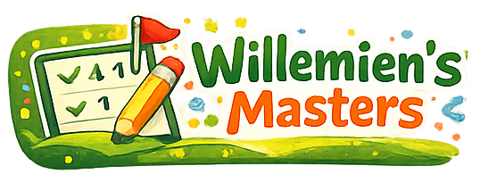

# Willemien's Masters ⛳

Live golf score-app voor kleine groepen. Geen download vereist — spelers scannen een QR-code of voeren een code in om het live leaderboard te volgen.



---

## Features

### 🏌️ Rondje beheren
- Nieuw rondje aanmaken met baannaam, spelers, handicaps en aantal holes
- Keuze tussen **Strokeplay** en **Stableford**
- Eerder gebruikte baan- en spelernamen worden automatisch als suggestie aangeboden
- Rondje delen via **WhatsApp** of link

### 📊 Live leaderboard
- Real-time updates via Firebase Firestore
- Medailles 🏆🥈🥉 voor de top 3
- Score weergegeven als slagen + t.o.v. par
- Rondje afsluiten met doorverwijzing naar het dashboard

### ✏️ Score invoeren
- Klassieke scorekaart: alle spelers naast elkaar per hole
- Tot 5 spelers per scherm, bij meer worden groepen gevormd
- Cel kleurt mee: blauw (birdie), groen (par), oranje (bogey), rood (dubbel bogey+)

### 🏆 Voorgaande edities
- Overzicht van alle afgesloten rondjes
- Filter per golfbaan
- Per speler uitklapbare tijdlijn met vooruitgang per editie (▲/▼)
- Rondjes verwijderen

### 📅 Agenda
- Activiteiten plannen met naam, datum/tijd en optionele omschrijving
- 2-koloms kaartweergave met countdown (bijv. "Over 5 dagen")
- Activiteiten toevoegen, bewerken en verwijderen

---

## Tech stack

| Onderdeel | Keuze |
|---|---|
| Framework | Next.js 16 (App Router) |
| Database | Firebase Firestore (real-time) |
| Styling | Tailwind CSS v4 |
| Taal | TypeScript |
| Hosting | Vercel |

---

## Lokaal draaien

```bash
# 1. Kopieer de environment-template
cp .env.local.example .env.local

# 2. Vul je Firebase-waarden in (zie stap hieronder)
# Bewerk .env.local

# 3. Installeer dependencies
npm install

# 4. Start de dev-server
npm run dev
```

Open [http://localhost:3000](http://localhost:3000).

---

## Firebase instellen

1. Ga naar [console.firebase.google.com](https://console.firebase.google.com)
2. Maak een project aan of gebruik een bestaand project
3. Voeg een **Web app** toe → kopieer de `firebaseConfig`-waarden naar `.env.local`
4. Ga naar **Firestore Database** → maak een database aan in **test mode**
5. Aanbevolen regio: `eur3 (europe-west)`

### Firestore collections

| Collection | Beschrijving |
|---|---|
| `rounds` | Alle golfrondes met spelers en scores |
| `activities` | Agenda-activiteiten |

---

## Deployen op Vercel

1. Push deze map naar een GitHub-repository
2. Ga naar [vercel.com](https://vercel.com) → **Add New Project** → importeer de GitHub-repo
3. Stel de volgende **Environment Variables** in via het Vercel dashboard:

```
NEXT_PUBLIC_FIREBASE_API_KEY
NEXT_PUBLIC_FIREBASE_AUTH_DOMAIN
NEXT_PUBLIC_FIREBASE_PROJECT_ID
NEXT_PUBLIC_FIREBASE_STORAGE_BUCKET
NEXT_PUBLIC_FIREBASE_MESSAGING_SENDER_ID
NEXT_PUBLIC_FIREBASE_APP_ID
```

4. Klik **Deploy** — elke push naar `main` deployt automatisch

---

## Golfbanen toevoegen (GPS-herkenning)

Bewerk [`lib/courses.ts`](lib/courses.ts) om golfbanen toe te voegen. Coördinaten vind je via Google Maps (rechts-klik → "Wat is hier?"):

```ts
{
  id: 'mijn-golfclub',
  name: 'Mijn Golfclub',
  lat: 52.370216,
  lng: 4.895168,
  holes: 18,
  radiusKm: 1.0,
}
```

---

## Projectstructuur

```
app/                        Next.js pagina's
  page.tsx                  Dashboard (home)
  agenda/page.tsx           Agenda
  history/page.tsx          Voorgaande edities
  round/[roundId]/
    page.tsx                Live leaderboard
    score/page.tsx          Score invoeren
components/
  Footer.tsx                Footer met "Over"-toggle
lib/
  firebase.ts               Firestore verbinding
  scoring.ts                Stableford & strokeplay berekeningen
  courses.ts                Golfbaan GPS-data
  types.ts                  TypeScript types
public/
  logo.png                  Vierkant logo
  logo-breed.png            Breed logo (header)
  favicon.png               Favicon
```

---

## Over de Willemien's Masters

Ooit dacht iemand: *"Laten we een balletje slaan."* Dat balletje werd een rondje. Dat rondje werd een traditie. Die traditie heeft nu een eigen app.

De Willemien's Masters zijn het meest serieuze niet-serieuze golfevenement in de vakantie — begonnen als een gezellig uitje op de shortgolfbaan, uitgegroeid tot een heuse competitie met echte deelnemers, neppe trofeeën en oprechte spanning. Elke editie wordt het net iets competitiever, maar de borrel erna blijft gelukkig hetzelfde. 🍺

---

*Gemaakt door [Hoekies](https://hoekies.nl) · 2026*
